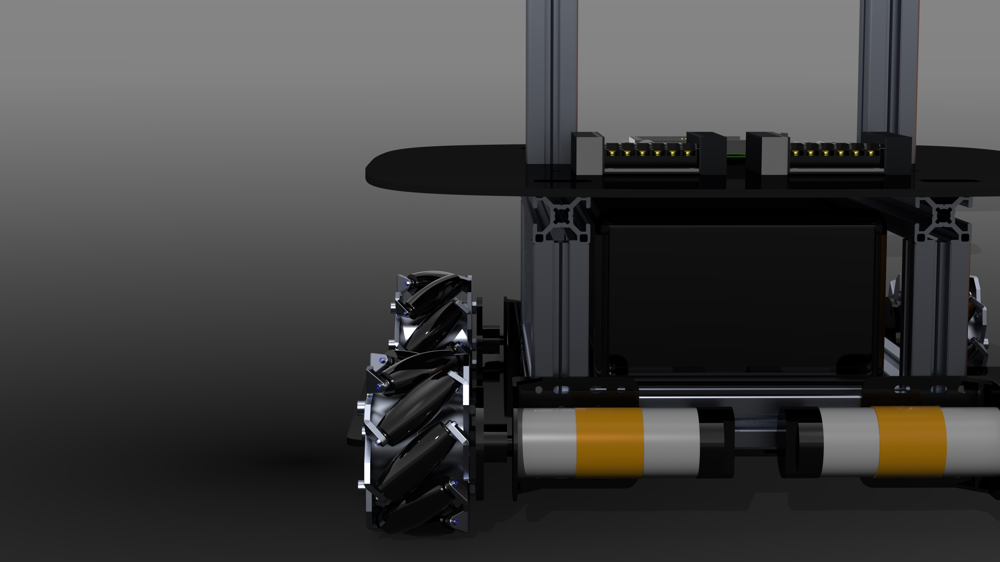
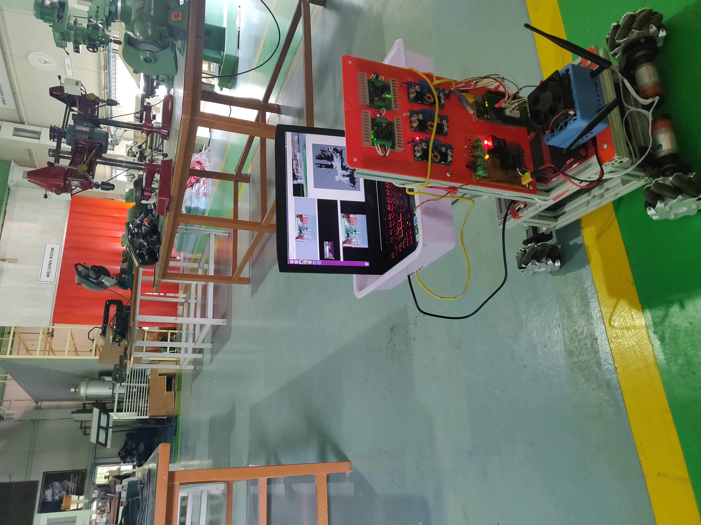

The aim of our project was to solve a similar kind of problem which involves prototyping a telepresence robot that has the features of autonomous navigation, path planning, simultaneous localization. The use case of the robot as an initial stage involves a full proof system to navigate in a predefined indoor environment with dynamic changes in the environment. The robot demonstrates the capabilities of bidirectional face-to-face communication, helping students in the lab, doing experiments where faculty can reach them remotely from virtually any place in the world. The human-robot interface designed to answer general questions about its purpose, new research projects in the lab, etc. Future possibilities might include abstractions in the software and hardware model to use it to navigate around the campus to assist students, visitors, and industry professionals.

My work includes,
- ROS navigation stack, Map creation using slam_gmapping and pgm-map creator, robot localization using ekf_localization_node and ukf_localization_node.
- Scripts for odometry data and motion control, Sensor data acquisition and Motion control algorithm.
- Circuit designs, power distribution system and Battery management system

## Extra credits

<!-- 

  
  

   -->

<!-- 

  
  

   -->

